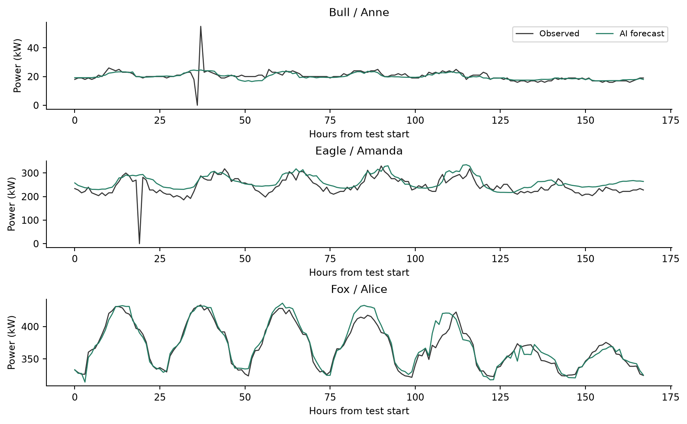
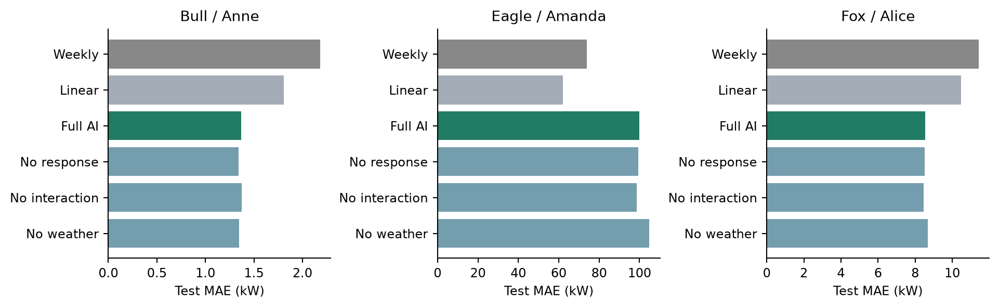
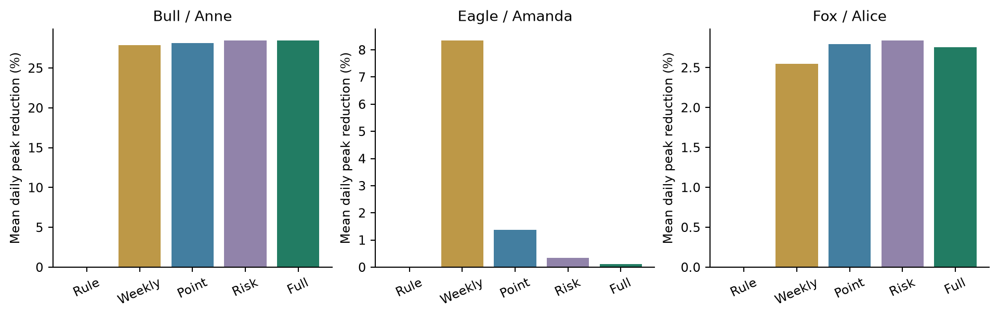
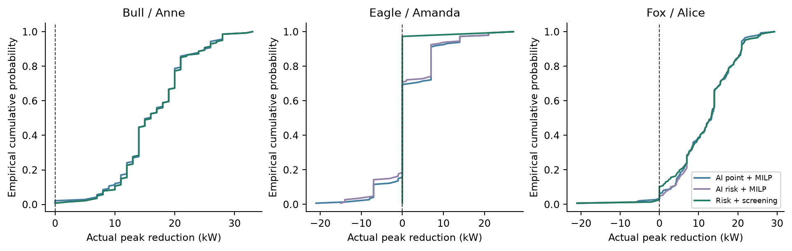
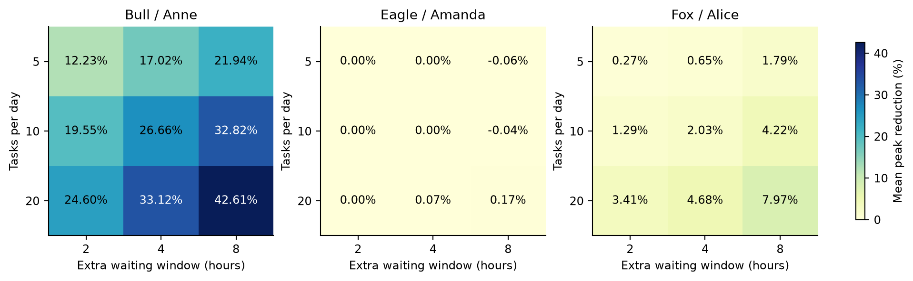
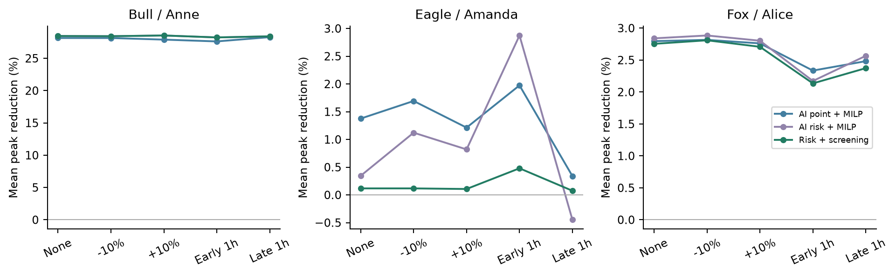
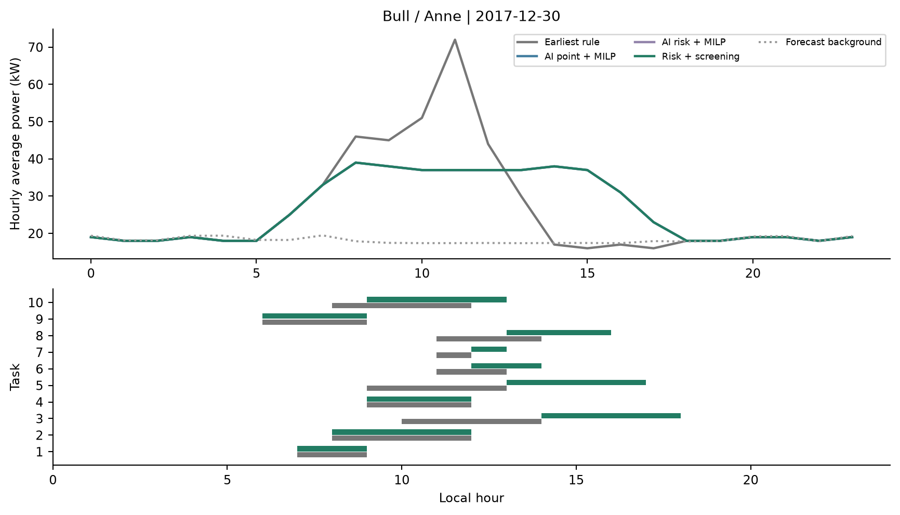
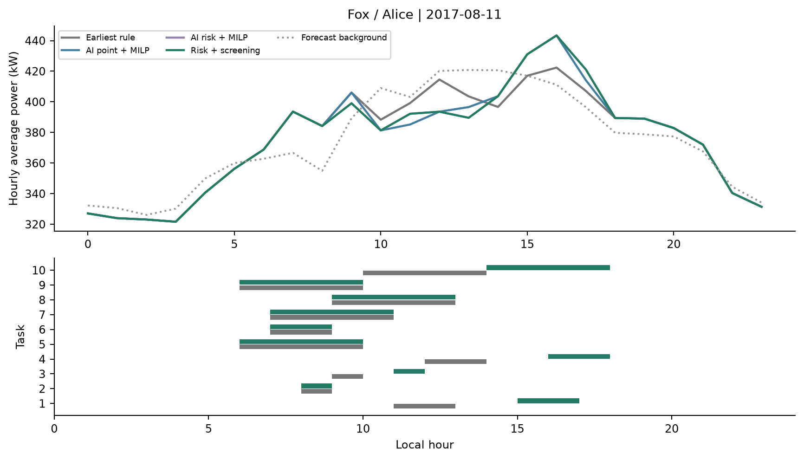

# 园区高峰用能预警与设备排程助手

公开数据回放与预约慢充仿真实验报告

实验运行 2026年10月6日　报告定稿 2026年10月7日

项目面向园区高峰用能管理，通过未来24小时负荷预测、误差情景排程和独立增益筛选，为预约慢充任务生成错峰建议。在满足充电窗口、充电位和站内功率约束的同时，保持任务总能量，降低建筑与充电负荷叠加后的日峰值。

实验采用3栋办公建筑连续两年的公开电表与天气数据，叠加程序生成的预约充电任务，覆盖8,955个案例，其中8,835个进入评分，共形成46,350条排程评价。核心指标为小时平均功率的日峰值变化。

完整方法在各建筑上的测试结果如下。削峰率按每个日期相对于最早可行启动规则计算，再对全部有效测试日取平均；被筛选机制拒绝调整的日期也计入。

| 建筑 | 测试日 | 平均削峰率 | 负向削峰日 | 建议输出率 |
| --- | --- | --- | --- | --- |
| Anne | 141 | 28.45% | 0.00% | 100.00% |
| Amanda | 147 | 0.12% | 0.00% | 3.40% |
| Alice | 147 | 2.75% | 2.72% | 93.88% |

相较风险排程，独立筛选将负向削峰日占比的建筑平均值从7.48%降至0.91%，建议输出率为65.76%，体现了收益与调整频率的取舍。

所有评分方案的任务按时完成率为100%，硬约束违反次数为0，任务能量最大偏差为0.000000 kWh。Amanda测试期含32个全零背景日，其数据质量诊断见第14节。

## 实验覆盖

完成预测基线、温度响应和交互特征消融、五组排程比较、7日块重采样区间、任务规模与灵活性、正负10%预测偏差、前后1小时峰时扰动、整日与独立小时残差对照、CVaR消融，以及窗口和容量冲突测试。完整数值及逐日方案见实验结果目录。

对照结果体现出建筑差异：Amanda的上周预测排程平均日削峰率高于AI点预测；CVaR未显示跨建筑稳定平均增益；Alice的独立筛选降低了平均收益。各模块的作用在预测、排程和消融结果中分别比较。

## 1 数据来源与样本选择

建筑负荷和天气来自 Building Data Genome 2（BDG2）作者仓库的 raw 电表版本，覆盖2016至2017年。电量单位为kWh，温度为摄氏度，电表与天气时间戳均采用数据集本地时间。[1] 电量除以一小时得到小时平均功率，数值相同。本实验沿用已标准化的逐日24小时索引，不另外进行夏令时转换。

| 简称 | 公开建筑编号 | 站点时区 | 面积 m² |
| --- | --- | --- | --- |
| Alice | Fox_office_Alice | US/Mountain | 18806.8 |
| Anne | Bull_office_Anne | US/Central | 1499.0 |
| Amanda | Eagle_office_Amanda | US/Eastern | 8487.9 |

选样只使用训练期数据：办公用途且有电表，非负有效值比例至少99.5%，正值比例至少95%，对应站点气温有效率至少95%。按建筑编号排序，每个站点取第一栋合格建筑，再取前三个站点。完整候选名单和选中标志保存在 selection_audit.csv，样本选择在测试评价前固定。

| 区间 | 开始日期 | 结束日期 | 天数 |
| --- | --- | --- | --- |
| 训练 | 2016-01-01 | 2017-03-13 | 438 |
| 调参 | 2017-03-14 | 2017-05-25 | 73 |
| 校准 | 2017-05-26 | 2017-08-06 | 73 |
| 测试 | 2017-08-07 | 2017-12-31 | 147 |

负值按缺失处理。历史输入只向前填补；观测序列开始前无历史时以0初始化，训练样本从第8日开始。预测标签不插补。排程回放要求当日24个真实背景值完整；缺失、规则失败和任务不可行分别留存排除记录。原始零值保留，结果可能受停机、计量异常及数据分布变化影响。

| 建筑 | 有效标签小时 | 完整测试日 | 零值小时 | 平均背景 kW |
| --- | --- | --- | --- | --- |
| Anne | 3520 | 141 | 89 | 19.88 |
| Amanda | 3528 | 147 | 1073 | 191.12 |
| Alice | 3528 | 147 | 1 | 359.01 |

累计120个案例未进入排程评分；逐条原因记录在 excluded_cases.json。数据下载版本固定为9b97ccbe90096aff42ed4fd6493bf7ae692d7118，三个原始CSV均保留SHA256核验值。

## 2 预测与误差情景方法

每天本地时间00时发出未来24小时预测。最新可用观测为前一日23时；真实未来负荷仅在回放评分和理想参考解中使用。LightGBM共享一个回归模型，以目标小时及1至24小时预测步长作为输入，直接输出各小时功率。[2] 模型只拟合训练段，在调参段按MAE选型，随后冻结；校准与测试标签不参与拟合。

| 特征组 | 实际使用内容 |
| --- | --- |
| 负荷历史 | 上一小时、前日同小时、上周同小时、24小时与7日均值/标准差/极值、缺失比例 |
| 日历 | 目标小时、星期、周末、工作时段代理、小时及年内日的正弦余弦编码、预测步长 |
| 历史气温 | 最新气温、24小时及7日均温、24小时变化；不输入目标日实测天气 |
| 温度响应 | 18℃参考点以上和以下的正部累计均值，分别以24小时和7日计算 |
| 运行交互 | 历史均温与工作时段/小时周期交互，制冷度时与工作时段交互 |

温度响应以18℃为统计参考点，办公时段以8至18时为代理特征，分别刻画温度变化和工作时间规律。

每个LightGBM版本均搜索6组配置：叶子数7、15、31，树数150、350；学习率0.05，最小叶节点样本40。线性对照采用训练期标准化后的普通最小二乘回归；所有预测统一截断到非负。上周与前日同小时参照只使用当时可观测的历史值。

### 整日残差与独立筛选

将校准段73日按日期分为前36日优化集与后37日筛选集，分别保留完整残差日。每次从相应集合有放回抽取50条24小时残差曲线，并加到点预测上，负值截为0。两组日期互不重叠，50条情景由各组完整残差日重复抽样得到。

| 建筑 | 优化残差日 | 筛选残差日 | 相邻小时相关 | 测试80%区间覆盖 |
| --- | --- | --- | --- | --- |
| Anne | 36 | 37 | 0.612 | 69.27% |
| Amanda | 36 | 37 | 0.706 | 47.87% |
| Alice | 36 | 37 | 0.887 | 82.43% |

区间覆盖率衡量由情景10%至90%分位构成的逐时区间覆盖实测值的比例。校准期与测试期的季节差异影响区间覆盖率，并进一步影响建议筛选效果。独立逐小时抽样实验保持各小时边际误差来源，破坏同一日误差相关结构。

## 3 预测对照结果

MAE与RMSE均以kW报告。高负荷定义为测试时段真实背景超过训练段95%分位数；各模型使用相同有效标签，高负荷阈值由训练期固定。

| 建筑 | 模型 | MAE | RMSE | 高负荷MAE | 高负荷小时 |
| --- | --- | --- | --- | --- | --- |
| Anne | 上周同小时 | 2.18 | 5.05 | 4.94 | 124 |
| Anne | 前日同小时 | 2.03 | 4.40 | 4.52 | 124 |
| Anne | 线性回归 | 1.81 | 3.35 | 5.09 | 124 |
| Anne | 完整LightGBM | 1.37 | 2.61 | 4.31 | 124 |
| Amanda | 上周同小时 | 73.93 | 137.71 | 272.91 | 35 |
| Amanda | 前日同小时 | 51.63 | 112.28 | 234.16 | 35 |
| Amanda | 线性回归 | 62.06 | 99.55 | 145.67 | 35 |
| Amanda | 完整LightGBM | 100.00 | 156.25 | 67.83 | 35 |
| Alice | 上周同小时 | 11.42 | 20.60 | 12.69 | 324 |
| Alice | 前日同小时 | 16.01 | 27.58 | 21.77 | 324 |
| Alice | 线性回归 | 10.48 | 17.04 | 15.13 | 324 |
| Alice | 完整LightGBM | 8.55 | 15.63 | 10.67 | 324 |

Anne的LightGBM相对上周参照MAE下降37.28%；Amanda的LightGBM相对上周参照MAE上升35.27%；Alice的LightGBM相对上周参照MAE下降25.12%。Amanda的测试标签中约30.4%为零，包含32个全零日；其总体MAE明显恶化。第14节对这一现象另作事后诊断。预测精度与排程收益分别通过误差指标和真实背景回放评价。

*图1 测试期首7日实测背景与24小时AI预测*

## 4 预测特征消融与高负荷提示

消融保持训练、调参、测试区间与参数搜索次数相同。移除温度响应时，同时移除依赖制冷度时的交互项；移除交互时只保留独立气温和响应特征；移除天气则删除全部气温及其派生特征。表中差值为该版本MAE减完整模型MAE，正值表示完整特征更好。

| 建筑 | 特征版本 | MAE | 差值 kW | 叶子数 / 树数 |
| --- | --- | --- | --- | --- |
| Anne | 完整LightGBM | 1.37 | 0.00 | 7 / 150 |
| Anne | 移除温度响应 | 1.34 | -0.03 | 7 / 150 |
| Anne | 移除交互 | 1.37 | 0.00 | 7 / 150 |
| Anne | 移除全部天气 | 1.35 | -0.02 | 7 / 150 |
| Amanda | 完整LightGBM | 100.00 | 0.00 | 15 / 150 |
| Amanda | 移除温度响应 | 99.33 | -0.67 | 31 / 150 |
| Amanda | 移除交互 | 98.70 | -1.31 | 15 / 150 |
| Amanda | 移除全部天气 | 104.92 | 4.92 | 7 / 350 |
| Alice | 完整LightGBM | 8.55 | 0.00 | 31 / 150 |
| Alice | 移除温度响应 | 8.52 | -0.03 | 31 / 150 |
| Alice | 移除交互 | 8.45 | -0.10 | 31 / 150 |
| Alice | 移除全部天气 | 8.67 | 0.12 | 31 / 150 |

三栋建筑移除温度响应后的测试MAE均略低于完整模型，交互特征也未显示稳定增益。当前数据下，简化这两类派生特征仍能保持相近的预测精度。

*图2 各建筑的预测误差及消融对比*

以优化情景中超过训练期高负荷阈值的比例作为风险提示，比例达到50%时报高负荷。下表为逐时结果，精确率衡量提示中真实高负荷的比例，召回率衡量真实高负荷被提示的比例。

| 建筑 | 阈值 kW | 精确率 | 召回率 | Brier分数 |
| --- | --- | --- | --- | --- |
| Anne | 25.00 | 77.78% | 6.19% | 0.0268 |
| Amanda | 426.04 | 60.00% | 25.71% | 0.0086 |
| Alice | 426.68 | 73.93% | 74.38% | 0.0329 |

## 5 充电任务与排程模型

背景负荷保持原始建筑量级，不缩放。每项独立预约任务的功率固定7 kW，连续运行1至4小时，释放小时从6至12时均匀抽样，额外等待窗口为2、4或8小时。共有10个充电位，站内功率上限70 kW。所有任务在排程时已知且在当日24小时内完成。

以每个任务在每个允许小时启动的0/1变量建模，要求每项任务恰好启动一次、整个持续时间落在允许窗口内、任一小时并行数不超过10且任务功率和不超过70 kW。原排程按释放时间、截止时间、编号排序，为每项任务选择最早满足容量的启动时刻。

每条情景的日峰值与最小化目标如下。B为背景功率，L为任务功率，t为启动时刻，上标0表示原排程，N为任务数，S为情景数。

$$
P_s=\max_{h\in\{0,\ldots,23\}}\left(B_{s,h}+L_h\right)
$$

$$
J=(1-w)\frac{1}{S}\sum_{s=1}^{S}P_s+w\,\operatorname{CVaR}_{0.9}(P)+\lambda\frac{1}{N}\sum_{j=1}^{N}\left|t_j-t_j^{0}\right|
$$

$$
\operatorname{CVaR}_{0.9}(P)=\min_{\eta}\left[\eta+\frac{1}{0.1S}\sum_{s=1}^{S}\max\left(P_s-\eta,0\right)\right]
$$

CVaR采用上述辅助变量线性化形式，[3] 对50条等权情景相当于取最差5条峰值的均值。相同情景压缩后以出现频次加权，目标保持不变。

候选排程在独立筛选情景中与原排程逐一配对计算日峰值差。仅当经验10%分位削峰量严格超过门槛才输出调整，否则回到原可行排程。经验分位数通过线性插值计算。

| 组别 | 输入和决策差别 |
| --- | --- |
| 最早规则 | 最早可行启动，所有方法共同参照 |
| 上周预测 | 上周同小时预测加确定性MILP |
| AI点预测 | LightGBM点预测加确定性MILP |
| 风险排程 | 50条整日误差情景加平均峰值与CVaR |
| 完整方法 | 风险候选方案加独立增益筛选 |

权重在调参期每7日取一个日期，用训练期三段递增窗口产生的滚动残差选取。候选风险权重为0.25、0.5、0.75，偏移惩罚为0、0.5、2 kW/平均小时，门槛为0、0.5、1、2 kW。调参得分为平均真实削峰量减2倍平均负向增峰量，再减0.1倍平均启动偏移。

训练滚动验证使用从第220、293、366日开始的三个连续73日区间，每段仅用其之前的训练数据拟合。为避免循环选型，这些滚动模型固定15叶、150树；校准与测试预测则使用调参期选出的最终模型。

| 建筑 | 风险权重 w | 偏移惩罚 λ | 筛选门槛 kW | 调参日期数 |
| --- | --- | --- | --- | --- |
| Anne | 0.25 | 2.0 | 0.0 | 11 |
| Amanda | 0.25 | 0.0 | 0.0 | 11 |
| Alice | 0.25 | 0.5 | 0.0 | 11 |

## 6 完整测试期排程结果

基准为每栋建筑测试段的全部完整日，每日10项任务、4小时灵活性。削峰率 = 100 ×（规则日峰值 - 方法日峰值）/ 规则日峰值。负向削峰日是方法峰值高于规则的日期；保留原方案的日期收益计0。下表按建筑分别列出。

| 建筑 | 方法 | 削峰 kW | 削峰率 % | 负向日 % | 建议日 % | 偏移 h |
| --- | --- | --- | --- | --- | --- | --- |
| Anne | 最早规则 | 0.00 | 0.00 | 0.00 | 0.00 | 0.00 |
| Anne | 上周预测 | 16.36 | 27.85 | 0.00 | 99.29 | 1.25 |
| Anne | AI点预测 | 16.50 | 28.14 | 0.00 | 98.58 | 1.18 |
| Anne | 风险排程 | 16.70 | 28.45 | 0.00 | 100.00 | 1.21 |
| Anne | 完整方法 | 16.70 | 28.45 | 0.00 | 100.00 | 1.21 |
| Amanda | 最早规则 | 0.00 | 0.00 | 0.00 | 0.00 | 0.00 |
| Amanda | 上周预测 | 1.58 | 8.34 | 28.57 | 98.64 | 1.44 |
| Amanda | AI点预测 | 1.79 | 1.38 | 16.33 | 91.84 | 0.85 |
| Amanda | 风险排程 | 1.35 | 0.35 | 19.73 | 89.80 | 0.70 |
| Amanda | 完整方法 | 0.47 | 0.12 | 0.00 | 3.40 | 0.04 |
| Alice | 最早规则 | 0.00 | 0.00 | 0.00 | 0.00 | 0.00 |
| Alice | 上周预测 | 10.83 | 2.55 | 3.40 | 98.64 | 0.99 |
| Alice | AI点预测 | 11.91 | 2.80 | 3.40 | 100.00 | 1.02 |
| Alice | 风险排程 | 12.12 | 2.84 | 2.72 | 100.00 | 1.14 |
| Alice | 完整方法 | 11.78 | 2.75 | 2.72 | 93.88 | 1.10 |

*图3 五组方法的平均日峰值削减率*

理想参考解使用已知真实背景，以日峰值最小化为目标，启动偏移惩罚设为0，用于衡量预测排程的改善空间。其平均削峰率为Anne 30.54%、Amanda 11.90%、Alice 3.63%。

## 7 配对置信区间与尾部表现

对同一建筑、同一日期的削峰率差进行7日连续移动块重采样，重复2000次，取2.5%与97.5%分位数。只使用连续的有效日期块。差值单位为百分点。区间描述各建筑历史测试日期上的不确定性，采用逐项比较口径，未作多重比较校正；区间包含0表示平均差异尚不明确。

| 建筑 | 配对比较 | 平均差值 | 95%区间 |
| --- | --- | --- | --- |
| Anne | 完整方法 - 规则 | 28.45 | [27.77, 29.76] |
| Anne | AI点预测 - 上周预测 | 0.29 | [-0.46, 1.01] |
| Anne | 风险排程 - AI点预测 | 0.31 | [-0.13, 0.79] |
| Anne | 完整方法 - 风险排程 | 0.00 | [0.00, 0.00] |
| Amanda | 完整方法 - 规则 | 0.12 | [0.00, 0.25] |
| Amanda | AI点预测 - 上周预测 | -6.97 | [-15.00, -1.21] |
| Amanda | 风险排程 - AI点预测 | -1.03 | [-3.04, 0.58] |
| Amanda | 完整方法 - 风险排程 | -0.23 | [-1.76, 1.25] |
| Alice | 完整方法 - 规则 | 2.75 | [2.48, 2.95] |
| Alice | AI点预测 - 上周预测 | 0.25 | [0.11, 0.35] |
| Alice | 风险排程 - AI点预测 | 0.04 | [-0.03, 0.14] |
| Alice | 完整方法 - 风险排程 | -0.09 | [-0.15, -0.03] |

*图4 实际削峰量的经验分布 横轴小于0表示产生增峰*

尾部指标使用真实回放日中削峰量最差的10%日期平均值，取向上取整的日期数。该指标评价真实回放中的不利削峰收益；优化目标中的CVaR则评价误差情景下的高峰值。

| 建筑 | 点预测最差10% kW | 风险最差10% kW | 完整最差10% kW |
| --- | --- | --- | --- |
| Anne | 6.07 | 7.07 | 7.07 |
| Amanda | -8.80 | -9.33 | 0.00 |
| Alice | -1.42 | -0.57 | -1.60 |

## 8 任务规模与灵活性实验

选择测试期每个月首个完整周一至周五，共25个日期；每个日期使用10组固定种子，交叉运行5、10、20项任务与2、4、8小时灵活性。共6,750个案例。相同日期和种子的任务功率、释放时刻与持续时间共用随机序列，各方法完全配对。

*图5 各建筑完整方法在9种任务设置下的平均削峰率*

下表对三个建筑的组均值等权平均，概括任务规模与灵活性的影响。同一建筑日的10个种子共享背景观测。分建筑的27种设置及各方法完整结果见 sensitivity_summary.csv。

| 任务数 | 灵活性 h | 上周 % | 点预测 % | 风险 % | 完整 % | 完整负向日 % |
| --- | --- | --- | --- | --- | --- | --- |
| 5 | 2 | 4.15 | 3.66 | 4.15 | 4.17 | 2.02 |
| 5 | 4 | 6.10 | 5.19 | 5.83 | 5.89 | 3.35 |
| 5 | 8 | 8.23 | 7.53 | 7.98 | 7.89 | 2.15 |
| 10 | 2 | 6.79 | 6.26 | 6.94 | 6.94 | 2.55 |
| 10 | 4 | 9.52 | 9.11 | 9.77 | 9.56 | 4.27 |
| 10 | 8 | 12.11 | 11.84 | 12.59 | 12.33 | 1.47 |
| 20 | 2 | 9.35 | 9.66 | 9.68 | 9.34 | 1.88 |
| 20 | 4 | 12.68 | 12.99 | 12.98 | 12.62 | 2.67 |
| 20 | 8 | 16.73 | 17.22 | 17.24 | 16.92 | 2.67 |

在这九组设置中，相同任务数下，更长的等待窗口对应更高的完整方法平均削峰率。等待窗口扩大了可行方案集合，实际收益同时受到筛选接受率、峰值时段、预测误差和容量竞争影响。各方法的任务总能量保持相同。

实验日期为2017年8月至12月各月首个完整工作周的周一至周五，固定种子为101至110。逐日记录见 [逐案例任务与排程](../experiments/results/schedule_cases.jsonl)。

## 9 预测扰动稳健性实验

保持测试真实背景、任务和约束不变，只将AI点预测整体乘0.9或1.1，或沿24小时周期前移/后移1小时。情景在扰动后的点预测上叠加相同历史残差。参数不重新调优。该移位作用于整条预测曲线，是受控时序误差压力试验。

| 建筑 | 扰动 | 点预测 % | 风险 % | 完整 % | 完整负向日 % |
| --- | --- | --- | --- | --- | --- |
| Anne | 无扰动 | 28.14 | 28.45 | 28.45 | 0.00 |
| Anne | 负偏差10% | 28.14 | 28.42 | 28.42 | 0.00 |
| Anne | 正偏差10% | 27.89 | 28.53 | 28.53 | 0.00 |
| Anne | 提前1小时 | 27.61 | 28.23 | 28.23 | 0.00 |
| Anne | 延后1小时 | 28.28 | 28.40 | 28.40 | 0.00 |
| Amanda | 无扰动 | 1.38 | 0.35 | 0.12 | 0.00 |
| Amanda | 负偏差10% | 1.69 | 1.12 | 0.12 | 0.00 |
| Amanda | 正偏差10% | 1.21 | 0.82 | 0.11 | 0.68 |
| Amanda | 提前1小时 | 1.97 | 2.87 | 0.48 | 2.72 |
| Amanda | 延后1小时 | 0.34 | -0.45 | 0.07 | 0.00 |
| Alice | 无扰动 | 2.80 | 2.84 | 2.75 | 2.72 |
| Alice | 负偏差10% | 2.82 | 2.88 | 2.81 | 2.72 |
| Alice | 正偏差10% | 2.76 | 2.80 | 2.71 | 2.72 |
| Alice | 提前1小时 | 2.33 | 2.17 | 2.13 | 10.88 |
| Alice | 延后1小时 | 2.48 | 2.57 | 2.37 | 2.04 |

*图6 预测偏差和时间错移对平均削峰率的影响*

上周参照保持不变，以分离AI预测扰动的影响。Anne在各扰动下的完整方法削峰率较稳定；Alice对提前1小时的时序误差更敏感，负向削峰日占比升至10.88%。这表明峰时识别是后续预测与滚动调整的重要改进方向。

## 10 排程模块消融

移除CVaR只优化情景平均峰值，保留相同偏移惩罚与求解时限；移除筛选即使用风险排程候选。独立小时版本分别从各小时误差列抽样，筛选版本也采用独立小时筛选情景。所有消融使用基准完整测试日期，权重不因测试消融结果重调。

| 建筑 | 版本 | 削峰率 % | 负向日 % | 建议日 % | 最差10% kW |
| --- | --- | --- | --- | --- | --- |
| Anne | 移除CVaR | 28.50 | 0.00 | 100.00 | 7.07 |
| Anne | 风险排程 | 28.45 | 0.00 | 100.00 | 7.07 |
| Anne | 完整方法 | 28.45 | 0.00 | 100.00 | 7.07 |
| Anne | 移除CVaR加筛选 | 28.50 | 0.00 | 100.00 | 7.07 |
| Anne | 独立小时抽样 | 28.46 | 0.00 | 100.00 | 7.53 |
| Anne | 独立小时加筛选 | 28.46 | 0.00 | 100.00 | 7.53 |
| Amanda | 移除CVaR | 1.01 | 20.41 | 93.88 | -10.00 |
| Amanda | 风险排程 | 0.35 | 19.73 | 89.80 | -9.33 |
| Amanda | 完整方法 | 0.12 | 0.00 | 3.40 | 0.00 |
| Amanda | 移除CVaR加筛选 | 0.10 | 0.00 | 3.40 | 0.00 |
| Amanda | 独立小时抽样 | 0.99 | 14.97 | 78.91 | -7.60 |
| Amanda | 独立小时加筛选 | 0.04 | 0.00 | 1.36 | 0.00 |
| Alice | 移除CVaR | 2.87 | 3.40 | 100.00 | -0.55 |
| Alice | 风险排程 | 2.84 | 2.72 | 100.00 | -0.57 |
| Alice | 完整方法 | 2.75 | 2.72 | 93.88 | -1.60 |
| Alice | 移除CVaR加筛选 | 2.80 | 3.40 | 94.56 | -1.95 |
| Alice | 独立小时抽样 | 2.55 | 4.76 | 100.00 | -2.62 |
| Alice | 独立小时加筛选 | 0.76 | 0.00 | 18.37 | 0.00 |

CVaR增量：Anne 平均-0.05个百分点，95%区间[-0.16, 0.06]；Amanda 平均-0.66个百分点，95%区间[-1.56, -0.02]；Alice 平均-0.03个百分点，95%区间[-0.09, 0.02]。

整日相关结构增量：Anne 平均-0.01个百分点，95%区间[-0.11, 0.18]；Amanda 平均-0.65个百分点，95%区间[-2.33, 0.97]；Alice 平均0.29个百分点，95%区间[0.22, 0.42]。

消融结果中，CVaR对平均削峰率的增量在三栋建筑均为负；整日残差相关结构在Alice上带来0.29个百分点的平均增益。模块选择需要结合平均收益、负向日占比和尾部表现。

## 11 完整方法收益最大的实例

选取完整方法削峰收益最大的测试案例：Bull_office_Anne，2017-12-30，10项任务、4小时灵活性。

*图7 真实回放总负荷与任务排程 灰色为原排程 绿色为完整方法*

| 方法 | 真实峰值 kW | 削峰量 kW | 削峰率 % | 平均偏移 h |
| --- | --- | --- | --- | --- |
| 最早规则 | 72.00 | 0.00 | 0.00 | 0.00 |
| 上周预测 | 38.00 | 34.00 | 47.22 | 1.60 |
| AI点预测 | 39.00 | 33.00 | 45.83 | 1.30 |
| 风险排程 | 39.00 | 33.00 | 45.83 | 1.30 |
| 完整方法 | 39.00 | 33.00 | 45.83 | 1.30 |

独立筛选情景的削峰量10%分位为32.73 kW，均值为33.70 kW；该建筑门槛为0.00 kW。因此本日接受了调整。真实回放削峰量为33.00 kW。

相同充电能量在允许窗口内重新分配，使日峰值从72.00 kW降至39.00 kW，平均启动偏移为1.30小时，所有任务保持连续运行并按时完成。

## 12 风险排程增峰最大的实例

选取风险排程增峰最大的测试案例：Fox_office_Alice，2017-08-11，10项任务、4小时灵活性。这也是完整方法的最不利日期。

*图8 真实回放总负荷与任务排程 灰色为原排程 绿色为完整方法*

| 方法 | 真实峰值 kW | 削峰量 kW | 削峰率 % | 平均偏移 h |
| --- | --- | --- | --- | --- |
| 最早规则 | 422.37 | 0.00 | 0.00 | 0.00 |
| 上周预测 | 443.37 | -21.00 | -4.97 | 1.10 |
| AI点预测 | 443.37 | -21.00 | -4.97 | 1.10 |
| 风险排程 | 443.37 | -21.00 | -4.97 | 1.40 |
| 完整方法 | 443.37 | -21.00 | -4.97 | 1.40 |

独立筛选情景的削峰量10%分位为8.27 kW，均值为15.31 kW；该建筑门槛为0.00 kW。因此本日接受了调整。真实回放削峰量为-21.00 kW。

当天候选方案通过独立筛选，但实际峰值增加21.00 kW，削峰率为-4.97%。预测与真实背景的峰时、幅值差异使任务移入了更高负荷时段，暴露出历史残差情景对当天误差刻画不足的问题。后续可结合实时负荷更新情景并滚动调整排程。原始任务与方案见 example_cases.json。

## 13 可行性检查与计算表现

对全部46,350条评分方案逐条重建任务功率曲线，检查允许时间、持续运行、截止时间、并行数量、站内功率和总能量，并重新计算真实峰值。任务按时完成率100%，硬约束违反0次，最大能量偏差0.000000 kWh，所有真实峰值复算一致。

| 异常场景 | 设置 | 检查结果 |
| --- | --- | --- |
| 窗口不足 | 4小时任务只有2小时窗口 | 判定不可行 |
| 充电位冲突 | 3项任务同时必须运行，只有2个位置 | 判定不可行 |
| 功率冲突 | 2项7 kW任务必须同时运行，上限7 kW | 判定不可行 |

另以6组小规模任务对50情景CVaR目标穷举所有可行启动组合，与MILP结果核对；并检验负情景截断、零收益不输出建议，以及任意改变预测起点之后的负荷与天气不影响当日起点特征。共12项检查通过，详细数值在 verification.json。

使用SciPy封装的HiGHS求解MILP，[4] 每次时限2秒、相对间隙0.001；达到时限但有可行解时采用该解，无可行候选时回退原规则并标记。耗时包含建模与求解，不包含预测训练和数据下载。计时环境为Python 3.12.14、macOS / arm64，并发4个案例，求解器各用1线程。

| 建筑 | 方法 | 平均秒 | 95%分位秒 | 时限次数 | 回退次数 |
| --- | --- | --- | --- | --- | --- |
| Anne | 上周预测 | 0.032 | 0.091 | 0 | 0 |
| Anne | AI点预测 | 0.120 | 0.360 | 0 | 2 |
| Anne | 风险排程 | 0.499 | 1.063 | 2 | 0 |
| Anne | 完整方法 | 0.499 | 1.063 | 2 | 0 |
| Amanda | 上周预测 | 0.008 | 0.014 | 0 | 0 |
| Amanda | AI点预测 | 0.012 | 0.033 | 0 | 0 |
| Amanda | 风险排程 | 0.023 | 0.063 | 0 | 0 |
| Amanda | 完整方法 | 0.023 | 0.063 | 0 | 0 |
| Alice | 上周预测 | 0.026 | 0.078 | 0 | 0 |
| Alice | AI点预测 | 0.026 | 0.101 | 0 | 0 |
| Alice | 风险排程 | 0.138 | 0.467 | 0 | 0 |
| Alice | 完整方法 | 0.138 | 0.467 | 0 | 0 |

完整方法复用风险候选，只额外进行50情景的筛选；表中完整方法耗时沿用候选建模求解耗时，未单独计时筛选计算。求解器状态与最优间隙逐次保存在原始记录中，用于区分达到容差的解和限时可行解。全部独立求解状态计数为{'0': 27054, '1': 730, '4': 26}：0表示达到指定最优性容差，1表示预算终止，4表示求解器异常。26次异常均发生在Anne的点预测排程，已回退原可行排程并计入主结果；异常复跑记录单独保存，不替换主结果。

## 14 零读数与分布变化诊断

Amanda测试期零读数明显增多，集中于10月至12月。本节在固定主实验之外，按标签是否为零开展事后分组诊断，分析数据状态变化与预测误差的关系。零读数的具体原因仍待结合停机记录与计量状态确认。

| Amanda月份 | 平均背景 kW | 零读数小时 | 全部小时 | 全零日数 |
| --- | --- | --- | --- | --- |
| 2017-08 | 253.19 | 1 | 600 | 0 |
| 2017-09 | 244.38 | 1 | 720 | 0 |
| 2017-10 | 33.01 | 635 | 744 | 26 |
| 2017-11 | 227.88 | 174 | 720 | 6 |
| 2017-12 | 212.05 | 262 | 744 | 0 |

下表比较24小时均有观测且没有零值的完整日期，其中Amanda为83日。该分组反映正值背景下的表现，主实验仍使用原定全部有效日期。

| 建筑 | 诊断日数 | 上周MAE | 线性MAE | AI MAE | 完整削峰率 % |
| --- | --- | --- | --- | --- | --- |
| Anne | 137 | 1.70 | 1.33 | 1.06 | 28.74 |
| Amanda | 83 | 51.24 | 24.10 | 22.17 | 0.09 |
| Alice | 146 | 11.15 | 10.22 | 8.32 | 2.73 |

Amanda在完整正值日上的AI预测MAE为22.17 kW，低于主实验的100.00 kW，说明模型误差与零值状态密切相关。运行状态识别与计量质量检查是后续现场接入的重点。

全零背景日的削峰来自充电任务之间的错峰，对百分比指标影响较大；若零值源于计量中断，则该日真实背景有待补充核验。分组数值见 posthoc_forecast_zero_diagnostics.csv 和 posthoc_scheduling_zero_diagnostics.csv。

## 15 项目价值与应用展望

项目将负荷预测、误差情景、约束排程和独立增益筛选连接为完整的用能决策流程。三栋建筑的完整方法平均日削峰率为0.12%至28.45%，负向削峰日占比为0.00%至2.72%；全部评分方案满足任务窗口、充电位、站内功率和能量约束。

### 技术发现

预测与排程效果具有建筑差异。LightGBM在Anne、Alice上的MAE优于上周参照，Amanda则受到零读数与运行状态变化影响。排程中，Alice的AI点预测相对上周预测具有明确的平均削峰率增益；Anne的相应配对区间包含0，Amanda则以上周预测更高。

独立筛选提供了控制调整频率的手段：Amanda的负向削峰日占比由风险排程的19.73%降至0.00%，建议输出率降至3.40%；Alice筛选后的平均收益略有下降。CVaR对平均削峰率未显示跨建筑稳定增益，整日误差相关结构则在Alice上优于独立逐小时抽样。

绝对削峰量与日削峰率反映不同侧面。例如，Amanda点预测的平均削峰量为1.79 kW，高于上周预测的1.58 kW，但其平均日削峰率更低。建筑背景负荷和充电任务相对规模共同影响百分比结果，方案评价需结合绝对量、增峰情况和调整幅度。

### 当前验证条件

实验覆盖3个站点的3栋办公楼，采用一次固定的训练、调参、校准和测试划分，置信区间基于7日移动块重采样。建筑负荷按原始量级保留，仿真充电任务作为额外负荷叠加。评价采用小时平均功率，任务总能量保持不变，容量约束作用于充电站任务功率。预约采用提前已知、日内完成和恒功率设定。

### 未来应用场景

| 场景 | 应用方式 | 后续接入重点 |
| --- | --- | --- |
| 办公园区预约充电 | 根据离场期限与充电需求生成日前错峰建议，辅助运营人员安排充电 | 真实预约、车辆状态、站内计量与变压器余量 |
| 园区用能监测 | 在能源管理平台展示预测高峰、可调整任务和预计削峰量，支持运行中重新排程 | 实时负荷、设备状态、异常计量识别与滚动预测 |
| 多设备协同排程 | 扩展至储能、蓄冷及可延后运行设备，协调不同设备的运行时段 | 荷电状态、舒适度、启停及跨日约束 |
| 光伏消纳与需求响应 | 联合优化负荷时序、光伏就地消纳和用能成本 | 光伏预测、电价、计费规则与响应指令 |

后续将从真实预约慢充试点切入，接入更细时间粒度的计量数据，对比建议排程与实际执行结果。重点验证峰值变化、任务按时完成率、用户等待时间和运营成本，并据此完善状态识别、误差情景与滚动调整机制。

## 16 复现材料与参考文献

复现入口见 [项目首页](../README.md)。材料包含固定协议、算法代码、LightGBM 文本模型、完整逐日结果、数据校验和及图表。完整重跑按固定版本下载原始数据并生成模型，依赖版本见 [requirements-lock.txt](../requirements-lock.txt)。下表中的结果文件均位于 `experiments/results/`。

| 文件 | 用途 |
| --- | --- |
| [实验配置](../experiments/config/protocol.json) | 时间划分、参数候选、随机种子、时限和评价口径 |
| selection_audit.csv 和 data_quality.csv | 选样证据、各区间缺失及零值统计 |
| forecast_metrics.csv 和 forecast_tuning.csv | 预测对照、消融和调参记录 |
| schedule_cases.jsonl | 所有任务参数、开始时间、求解状态和逐日指标 |
| baseline_summary.csv 等汇总表 | 基准、规模、扰动、消融与配对置信区间 |
| verification.json 和 result_audit.json | 穷举验证、泄漏检查、不可行提示和输出方案审计 |

模型代码、实验执行、统计分析和报告编写使用Codex辅助完成，参与范围见 [AI辅助使用说明](AI辅助使用记录.md)。

数据署名与共享条款见 [第三方来源与署名](../THIRD_PARTY_NOTICES.md) 及 [许可原文](../experiments/data/raw/LICENSE)。

[1] MILLER C, KATHIRGAMANATHAN A, PICCHETTI B, et al. The Building Data Genome Project 2, energy meter data from the ASHRAE Great Energy Predictor III competition[J]. Scientific Data, 2020, 7: 368. DOI: 10.1038/s41597-020-00712-x. 作者数据仓库 https://github.com/buds-lab/building-data-genome-project-2 ，作者公开全文 https://arxiv.org/html/2006.02273v4 。

[2] KE G, MENG Q, FINLEY T, et al. LightGBM: A highly efficient gradient boosting decision tree[C]//Advances in Neural Information Processing Systems. 2017, 30: 3146-3154. 参数文档 https://lightgbm.readthedocs.io/en/stable/Parameters.html 。

[3] ROCKAFELLAR R T, URYASEV S. Conditional value-at-risk for general loss distributions[J]. Journal of Banking & Finance, 2002, 26: 1443-1471. DOI: 10.1016/S0378-4266(02)00271-6. 作者公开稿 https://sites.math.washington.edu/~rtr/papers/rtr187-CVaR2.pdf 。

[4] SCIPY. scipy.optimize.milp API documentation[EB/OL]. https://docs.scipy.org/doc/scipy/reference/generated/scipy.optimize.milp.html ，访问日期2026-10-06。
